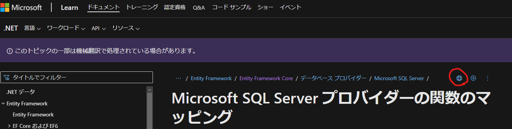

# LINQ研修 テキスト 問題編

## 演習の目標

現場で見かけた非効率なコードに似せた演習プログラムをもとに、以下の技術を学びます。

* LINQ to Object, LINQ to Entityのしくみ、効率を意識した書き方、デバッグ方法
* LINQ to Objectのカスタムクエリの実装方法
* LINQ to Entityの動的クエリの実装方法

---

## 準備

* このテキストを読み、わからない言葉などを調べておく
* [環境](#環境)と[ビルド](#ビルド)の項目に従い、演習プログラムのビルドを通しておく
* LINQに馴染みの少ない方は勉強しておく
[［完全版］究極のC#プログラミング Chapter15 LINQとクエリ式](https://atmarkit.itmedia.co.jp/fdotnet/csharp30/index/index.html)

---

## 環境

あらかじめインストールしておいてください。

### ないと動かないもの

* [.NET Core 3.1 SDK 3.1.425](https://dotnet.microsoft.com/en-us/download/dotnet/3.1) Version 3.1.31
* [EF Core command-line tools](https://learn.microsoft.com/en-us/ef/core/cli/dotnet) Version 3.1.31

### あると便利なもの

* IDE ([Visual Studio](https://visualstudio.microsoft.com/vs/community/) + [ReSharper](https://www.jetbrains.com/resharper/), or [Rider](https://www.jetbrains.com/rider/))
* [SQL Server Management Studio (SSMS)](https://learn.microsoft.com/en-us/sql/ssms/download-sql-server-management-studio-ssms?view=sql-server-ver16)

#### EF Core command-line toolsのインストール

```bat
dotnet tool install --global dotnet-ef
```

---

## ビルド

[GitHubに演習プログラムを置いてあります](https://github.com/h-uchiy/LINQTraining)ので、cloneするかダウンロードして、ビルドを通しておいてください。

```bat
cd C:\gitreps\LINQTraining\LINQTraining
dotnet ef migrations add InitialCreate
dotnet ef database drop
dotnet ef database update
dotnet build
dotnet test
```

[dotnet ef コマンドのリファレンス](https://learn.microsoft.com/en-us/ef/core/cli/dotnet#dotnet-ef-database-drop)

---

## 調べ物の仕方

普通にGoogleで検索すればよいです。
ただし、

* **検索キーワードは英語で入力する**
* **検索結果の表示言語は英語に設定しておく**
* 検索結果の精度がいまいちの時は**過去1年以内に更新されたもの**に絞ってみる

日本人としては残念ですが、**日本語の検索結果はノイズ**だと思ったほうがいいです。

### 検索キーワードの選び方

別に難しくはないですが、慣れが必要かもしれません。

例）Entity Framework Core がSQL Serverに送るSQLのログの取り方
→ 「EF Core SQL logging」

---

### Microsoft Documentの読み方

日本語は大部分が機械翻訳なので、意味不明な訳がされていたり、全く逆の意味に誤訳されていることもあるので、必ず英語を読みます。
とはいえ、頭から英語で読むのもしんどいので、日本語でナナメ読みしてから英語でちゃんと読むのがおすすめです。

* 日本語から英語への切り替えは、をクリックします。
* 英語から日本語への切り替えは、URLの`en-us`を`ja-jp`に書き換えます。


---

## 演習プログラムの構成

* プロジェクトは問題編`LinqTraining`と解答編`LinqTraining-Answer`があります。
* 演習問題は`Excercise.cs`にて、xUnitのテストケースとして作成してあります。
* テストケースは[AAAパターン(Arrange/Act/Assert)](https://qiita.com/inasync/items/e0b54e62784710c4b42d)で作成してあります。
  * Arrangeにてダミーのデータをデータベースに作成します。
  * Actが演習問題の本体で、別関数`ExerciseX_Act`にて実装しています。
  * Actを`Answers.cs`にある解答例と差し替えて実行することもできます。
* データモデルの一部のクラスには大量のプロパティ`ColumnXXX`を定義してあります。これは大量の列が定義されている現実のプロジェクトのテーブルを模したもので、非効率なクエリが一目でわかるように作成しています。
* 実際に実行されるSQLをログに出力します。やり方は`TrainingContext.cs`を見てください。

---

### 演習プログラムのデータモデル


---

## 演習1

```c#
private static async List<Exercise1Result> Exercise1_Act(
    TrainingContext context, string metadataCode)
{
    var metadataValues = context.DataValues
        .Include(x => x.Metadata)
        .Where(x => x.Metadata.Code == metadataCode);

    var result = new List<Exercise1Result>();
    foreach (var metadataValue in metadataValues.ToList())
    {
        result.Add(new Exercise1Result
        {
            DataType = metadataValue.Metadata.DataType,
            DataType = metadataValue.Value
        });
    }

    return result;
}
```

---

### 仕様

`metadataCode`で指定されたコードに一致する`Metadata.Code`を持つ`DataValue`から、`DataType`と`Value`を取得します。

### 問題

* このメソッドが戻り値を生成するために必要なデータは、条件に一致する`Metadata`の、`DataType`と`Value`のみです。にもかかわらず、このメソッドはそれ以外のデータを大量にDBから取得するため、遅いです。
* このメソッドが行っていることに比べると、実装が複雑です。

### 課題

このメソッドをリファクタリングして、必要最小限のデータのみをSQL Serverから取得するように改善してください。

---

### ヒント

* 一見すると複雑に見えますが、選択と射影(filter & map)しかしていないことに、すぐに気づいてほしいです。LINQはそのための道具なので、この程度のことは1行で記述できます。
* ループを解消してください。ReSharper/Riderであれば、自動リファクタリングで片付きます。
* `IQueryable`が実行しようとする式や、実際に実行されるSQLを確認して、最終的に必要なデータ以外の列をDBから取得しないようにしてください。
* 無駄な`ToList()`を削除して、データをメモリに展開しないようにしてください。Exercise1_Actの戻り値は`IQueryable`に変更しても構いません。
* Joinを使った式に書き直してみましょう。

---

## 演習2

開発中は問題なく動作するが、実運用でデータが増えると使い物にならない、という事例です。

```c#
private static void Exercise2_Act(DataTable dataTable, IEnumerable<ErrorInfo> errorsList)
{
    foreach (var row in dataTable.Rows.OfType<DataRow>())
    {
        var errors = errorsList.Where(y =>
            int.TryParse(row["Row No"].ToString(), out var rowNo) && y.RowNo == rowNo);
        if (errors.Any())
        {
            row["Error Column"] = string.Join(",", errors.Select(x => x.ColumnName));
        }
        else
        {
            row["Error Column"] = string.Empty;
        }
    }
}
```

---

### 仕様

* `dataTable`には、1で始まる行番号'Row No'列のほか、多数の列があります。
* `errorsList`には、エラーがある行の番号と、列の名前が入っています。
* `dataTable`に'Error Column'列を追加して、エラーがある列の名前を書き込みます。
  * 同じ行の複数の列にエラーがある場合は、それらの列名をカンマ区切りで'Error Column'列に書き込みます。

### 問題

`dataTable`の件数に比例して`errorsList`の件数も増える場合

* 開発中に1000件のダミーデータで動かすと瞬時に処理が完了する
* 実運用で10万件のデータが入れられると10分経っても処理が完了しない

---

### 課題

実運用に耐えられるように改善してください。

### ヒント

* ReSharper/Riderでは["Multiple Enumeration"](https://www.jetbrains.com/help/rider/PossibleMultipleEnumeration.html)という警告が発生します。これを解消してください。
* どこが遅いのか、プロファイラを使って特定してください。
  * [Visual Studio 2022付属のプロファイラの使い方](https://learn.microsoft.com/en-us/visualstudio/profiling/beginners-guide-to-performance-profiling)
  * [ReSharper付属のプロファイラの使い方](https://www.jetbrains.com/help/profiler/Profiling_Guidelines__Profiling_Unit_Tests.html)
* dataTableとerrorsListの行数を増やすと、行数を増やした以上に遅くなります。（概ね2倍にすると4倍、10倍にすると100倍。指数関数的に遅くなる）
なぜこのようになるのか考えて、これを解消してください。

---

## 演習3 - カスタムクエリメソッドを実装する（即時実行編）

* 標準の`ToArray()`, `ToList()`, `ToHashSet()`, `ToDictionary()`, `ToLookup()`のように、コンテナに変換するメソッド`ToSortedSet()`, `ToSortedList()`, `ToSortedDictionary()`を`EnumerableExtensions.cs`に作成してください。
* 上記のそれぞれについて、非同期版`~Async()`を`QueryableExtensions.cs`に作ってください。

### ヒント

* `int`や`string`などの組込型だけでなく、任意のユーザー定義型でも、検索アルゴリズムが正しく動作するようにしてください。
* 標準のメソッドのソースコードを読んで、真似してください。

---

## 演習4 - カスタムクエリメソッドを実装する（遅延実行編）

`EnumerableExtensions.cs`に作成してください。

* 標準の`Distinct()`には、`OrderBy()`や`ToDictionary()`のようにキーを指定する機能が無いので不便です。 キーを指定できる[`DistinctBy()`](https://learn.microsoft.com/en-us/dotnet/api/system.linq.enumerable.distinctby)を作成してください。
* シーケンスを指定されたサイズの配列に分割する[`Chunk()`](https://learn.microsoft.com/en-us/dotnet/api/system.linq.enumerable.chunk)を作成してください。

### ヒント

* [`yield return`](https://learn.microsoft.com/en-us/dotnet/csharp/language-reference/statements/yield)を使って実装してください。
* 以上の課題のメソッドはすべて.NET6で追加されたものです。.NET Core 3.1以前のプロジェクトで同じことをしたい場合、自作できると便利です。

---

## 演習5

```c#
private static async Task<Exercise5Result> Exercise5_Act(TrainingContext context)
{
    var codes = new List<string>();
    var duplicatedCodes = new List<string>();
    await foreach (var map in context.Mappings.AsAsyncEnumerable())
    {
        var key = map.CodeA + " " + map.CodeB;
        if (codes.Any(x => x == key))
        {
            if (duplicatedCodes.All(x => x != key))
            {
                duplicatedCodes.Add(key);
            }
        }
        else
        {
            codes.Add(key);
        }
    }

    return new Exercise5Result(codes, duplicatedCodes);
}
```

---

### 仕様

CodeAとCodeBの組み合わせが格納されたテーブルMappingsをインポートします。

* CodeAとCodeBのの組み合わせは`[CodeA][SPACE][CodeB]`として表現します。
* 重複する組み合わせを`duplicatedCodes`に格納します。
* uniqueとなる組み合わせを`codes`に格納します。

### 問題

Mappingsテーブルの行数が多くなると、とても時間がかかります。

### 課題

遅い理由を説明し、10万行でも1秒以内に完了するように改善してください。

### ヒント

演習2で学んだことを思い出してください。

---

## 演習6

LINQ to Entityの制約を学ぶ問題です。

```c#
private static IQueryable<Exercise6Result> Exercise6_Act(
    TrainingContext context, IEnumerable<string> metadataCodes)
{
    return from dv in context.DataValues.Include(x => x.Metadata)
        join mc in metadataCodes on dv.Metadata.Code equals mc
        select new Exercise6Result
        {
            MetadataCode = dv.Metadata.Code,
            Value = dv.Value
        };
}
```

---

### 仕様

`metadataCodes`で指定された複数の`Metadata`に対する`DataValue`を取得します。

### 問題

このコードは一見すると動作するように見えます。
しかし実際には、コンパイルは通りますが、実行するとエラーが発生します。

### 課題

* エラーが発生する理由を説明してください。
* エラーを修正して動作するようにしてください。

---

### ヒント

* LINQ to Entityには、コンパイルは通っても、C#の式をSQLに変換できないため実行できない、という場合があります。
* LINQ to Entityの変換能力の制約は「[複雑なクエリ演算子](https://learn.microsoft.com/en-us/ef/core/querying/complex-query-operators)」に解説されています。
* また、Transact-SQLに変換できるC#の関数は「[Microsoft SQL Server プロバイダーの関数のマッピング](https://learn.microsoft.com/en-us/ef/core/providers/sql-server/functions)」に一覧があります。ここにない関数をWhere式に書いても、SQLに変換してSQL Server上で実行できないので、エラーになります。
* Where式には書けない関数も、Select式には書けます。なぜなら、Where式はSQL Server上で実行されるものですが、Select式はSQL Serverに対して取得したい列を指定できればよく、値の生成はC#側で実行されるからです。

---

## 演習7

```c#
private static IEnumerable<Exercise7Result> Exercise7_Act(TrainingContext context, string dataCategoryCodes)
{
    var results = new List<Exercise7Result>();
    foreach (var dataCategory in context.DataCategory.Where(x => x.Code == dataCategoryCodes))
    {
        if (dataCategory.MetadataDataCategory.Any())
        {
            foreach (var metadataDataCategory in dataCategory.MetadataDataCategory)
            {
                results.Add(new Exercise7Result
                {
                    DataCategoryName = dataCategory.Name,
                    MetadataName = metadataDataCategory.Metadata.Name,
                });
            }
        }
        else
        {
            results.Add(new Exercise7Result
            {
                DataCategoryName = dataCategory.Name,
                MetadataName = null,
            });
        }
    }

    return results;
}
```

---

### 仕様

* このメソッドは、一体何をしようとしているのか、考えてみてください。

### 問題

* 一見すると難しいことをしているように見えますが、実は簡単なことを難しくして書いています。
* そのために、SQL Server上で完結できる簡単な計算を、CPUとメモリとネットワークを無駄遣いして実行しています。

---

### 課題

* 1行で書き直してください。
* 戻り値をIQueryableに変更して、SQL Server上で演算を完結させてください。

### ヒント

* DataCategory, MetadataDataCategory, MetadataのE-R図またはUMLを描いてみましょう。
* ループとif文を解消するリファクタリングを行ってみましょう。

* すると、SQLであればLEFT JOINで記述できる処理だとわかると思います。
* LINQでLEFT JOINを記述する方法は、知らないとわからないと思いますので、調べてみてください。
---

## 演習8

参照する列を動的に設定する事例です。

```c#
private IQueryable<string> Exercise8_Act(TrainingContext context, Metadata metadata)
{
    return context.DataValues
        .Where(x => x.MetadataId == metadata.Id)
        .Select(x => (string)typeof(DataValue)
            .GetProperty($"Column{metadata.ColumnIndex:D3}")
            .GetValue(x));
}
```

---

### 仕様

* 指定された`Metadata`に該当する`DataValue`について、`Metadata.ColumnIndex`で指定された`XXX`に該当する、`DataValue.ColumnXXX`の値を返します。

### 問題

一応動作していますが、実行されるSQLを見ればわかる通り、必要ない列のデータまですべて取ってきてしまうので効率が悪いです。

### 課題

必要な列(`DataValue.ColumnXXX`)のみを取得するように修正してください。

---

### ヒント

`Select`の引数にはラムダ式を指定します。
このラムダ式は、`IEnumerable`では、クエリオブジェクトからコールバックされるデリゲートにコンパイルされます。一方、`IQueryable`では、デリケートではなく、ラムダ式の記述内容を格納した[`Expression`](https://learn.microsoft.com/en-us/dotnet/csharp/programming-guide/concepts/expression-trees/)という構造体にコンパイルされます。
この`Expression`を自分で組み立てることで、[実行内容が動的に決定されるクエリを組む](https://learn.microsoft.com/en-us/dotnet/csharp/programming-guide/concepts/expression-trees/how-to-use-expression-trees-to-build-dynamic-queries)ことができます。
`Expression`について深入りすると別の研修が必要になるので深入りは避けますが、この演習プログラムの中にも使用している箇所がありますので、調べて真似して実装してみてください。

---

## 演習9

参照するテーブルを動的に設定する事例です。

```c#
private IQueryable<string> Exercise9_Act(TrainingContext context, DataValue dataValue)
{
    switch (dataValue.Metadata.CandidateList)
    {
        case "CandidateListA":
            return context.CandidateListA.Select(x => x.Value);
        case "CandidateListB":
            return context.CandidateListB.Select(x => x.Value);
        case "CandidateListC":
            return context.CandidateListC.Select(x => x.Value);
        default:
            throw new IndexOutOfRangeException();
    }
}
```

---

### 仕様

* `DataValue.Value`に設定できる値の候補リストが、`CandidateListX`という複数のテーブルに格納されているものとします。
* このメソッドは、指定された`DataValue`の候補リストを返します。
* `Metadata.CandidateList`に、候補リストのテーブル名が入っています。

### 問題

この実装では、候補リストのテーブルが増えると動作しなくなります。

### 課題

候補リストのテーブルが増えても動作するように修正してください。

---

### ヒント

大きく分けて次のいずれかの方法が考えられると思います。

1. `TrainingContext`に作られているプロパティを呼び出す方法
これは、リフレクションや`Expression`で実現できます。
1. `TrainingContext`に作られているプロパティと同じものを作る方法
これは、[`DbContext.Set<TEntity>`](https://learn.microsoft.com/en-us/dotnet/api/Microsoft.EntityFrameworkCore.DbContext.Set)メソッドによって実現できます。

