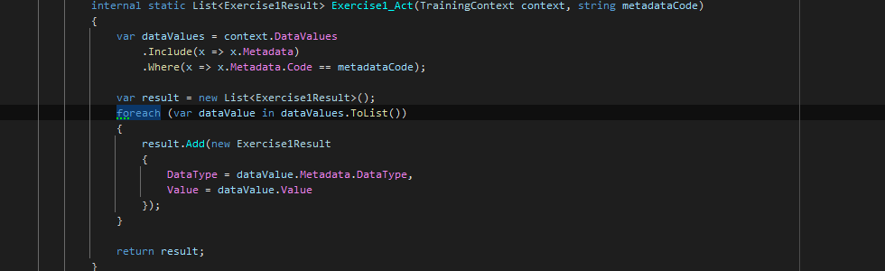
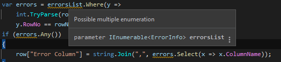
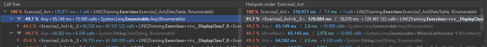
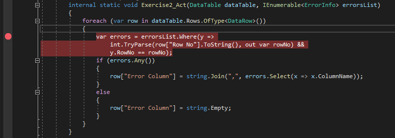
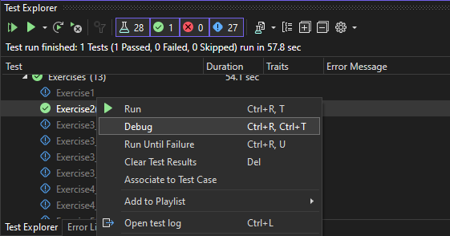
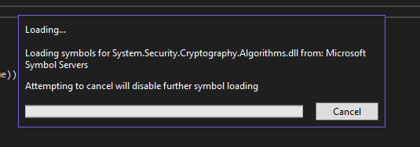
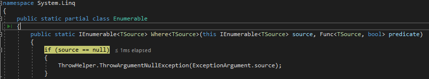
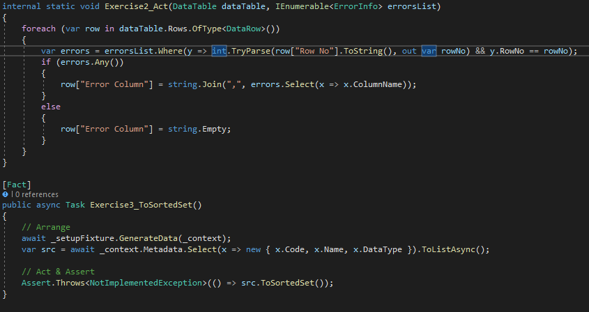
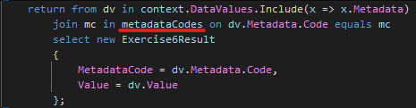

# LINQ演習 テキスト 解説編

---

## 演習1の解説

### ループの除去

* LINQは「集合を集合のまま演算する」ものです。ループを記述するということは、集合から要素を１つずつ取り出して演算するということですから、LINQを使う意味がありません。
* このパターンのループは機械的に`ToList()`に置き換えできます。これはReSharper/Riderの自動リファクタリングで書き換えたものです。


---

ループを除去すると、このように1行コード(One-liner)になります。

```c#
private static List<Exercise1Result> Exercise1_Act1(
    TrainingContext context, string metadataCode) =>
    context.DataValues
        .Include(x => x.Metadata)
        .Where(x => x.Metadata.Code == metadataCode)
        .ToList()
        .Select(metadataValue => new Exercise1Result
        {
            DataType = metadataValue.Metadata.DataType,
            Value = metadataValue.Value
        })
        .ToList();
```

メソッドの実装がOne-linerになった場合は[アロー式表現](https://learn.microsoft.com/en-us/dotnet/csharp/programming-guide/statements-expressions-operators/expression-bodied-members#methods)にするのがおすすめです。

---

### 即時実行APIと遅延実行API

* 上の例において、`Where`と`Select`は、APIが呼び出された時点では**クエリオブジェクト**を構築するだけです。データの取得や演算処理は即時実行APIが呼び出されるまで実行されないため、遅延実行(Deferred Execution)APIと言います。
* 一方で`ToList`は、その前段階で構築されたクエリオブジェクトからデータを取得して`List`を作ります。これは実際にデータを取得しないと実現できない処理です。APIが呼び出された時点で、クエリオブジェクトのチェーンを遡って演算処理とデータの取得が行われるため、即時実行(Immediate Execution)APIと言います。

[Classification of Standard Query Operators by Manner of Execution (C#)](https://learn.microsoft.com/en-us/dotnet/csharp/programming-guide/concepts/linq/classification-of-standard-query-operators-by-manner-of-execution)

---

### クエリオブジェクト

* 私は、遅延実行APIが返すオブジェクトのことを**クエリオブジェクト**と呼んでいます。（一般的な用語ではありません）
* クエリオブジェクトとは、オブジェクトの集合そのものではなく、オブジェクトの集合からデータを取り出す方法を格納したオブジェクトのことです。
  * オブジェクトの集合は**コンテナ**と言います。
* クエリオブジェクトには、大きく分けて以下の種類があります。
  * [`IEnumerable<T>`](https://learn.microsoft.com/en-us/dotnet/api/system.collections.generic.ienumerable-1)を実装したもの - オブジェクトを列挙するオブジェクト（**イテレータ**）を返す。
  * [`IQueryable<T>`](https://learn.microsoft.com/en-us/dotnet/api/system.linq.iqueryable-1)を実装したもの - クエリプロバイダと、クエリプロバイダに渡す式を格納したもの。オブジェクトの列挙はクエリプロバイダが行う。

---

### LINQの原則

なるべくクエリオブジェクトのまま引っ張る。最終的にデータが必要になる時まで、`foreach`などのイテレーションや、`ToList()`などの即時実行関数を実行しない。

### LINQ to Entityの原則

なるべく`IQueryable`のまま引っ張る。

* `IQueryable`で記述されている部分は、SQLに変換される
* `IEnumerable`で記述されている部分は、メモリに展開されてC#上で実行される

絞り込みは`IQueryable`で行う。

* `IQueryable`で`Where`や`Select`をすると、条件に合う行と列のみがSQL Serverから取得される
* `IEnumerable`で`Where`や`Select`をしても、通信量を削減できない

---

### 原則に従ってリファクタリング

`ToList()`を除去して、戻り値も`IQueryable`に変更し、このようになります。

```c#
public static IQueryable<Exercise1Result> Exercise1_Act2(
    TrainingContext context, string metadataCode) =>
    context.DataValues
        .Where(x => x.Metadata.Code == metadataCode)
        .Select(x => new Exercise1Result
        {
            DataType = x.Metadata.DataType,
            Value = x.Value
        });
```

---

これは、こう書いても全く同じなので、読みやすい方で書けばよいと思います。

```c#
private static IQueryable<Exercise1Result> Exercise1_Act3(
    TrainingContext context, string metadataCode) =>
    from dv in context.DataValues
    where dv.Metadata.Code == metadataCode
    select new Exercise1Result
    {
        DataType = dv.Metadata.DataType,
        Value = dv.Value
    };
```

---

### 実際に実行されたSQLを比較する

この演習プログラムでは、EFがSQL Serverに送信しているSQLをコンソールに出力しています。（その方法は`TrainingContext.OnConfiguring`を見てください）
リファクタリング前や`Exercise1_Act1`では、このようなSQLが出力されています。

```sql
SELECT [d].[Id], [d].[Column000], [d].[Column001], ..., [d].[Column099], [d].[MetadataId],
 [d].[Value], [m].[Id], [m].[Column000], [m].[Column001], ..., [m].[Column099], [m].[Code],
 [m].[DataType], [m].[Name]
FROM [DataValues] AS [d]
    INNER JOIN [Metadata] AS [m]
ON [d].[MetadataId] = [m].[Id]
WHERE [m].[Code] = @__metadataCode_0
```

必要な列は`[Metadata].[DataType]`と`[DataValues].[Value]`のみなのに、不要な列が大量に取得されています。SQL Serverとの通信はネットワーク経由になるのが普通ですから、パフォーマンス上の大きなペナルティになり得ます。
これは、`Select`よりも前に`ToList`を実行しているので、必要な列が確定しないため、すべての列が取られてしまうためです。

---

`Exercise1_Act2`では、このように必要な列だけを取得するSQLになっています。

```sql
SELECT [m].[DataType], [d].[Value]
FROM [DataValues] AS [d]
    INNER JOIN [Metadata] AS [m]
ON [d].[MetadataId] = [m].[Id]
WHERE [m].[Code] = @__metadataCode_0
```

なお、SQLを見なくても、デバッガで[`IQueryable.Expression`](https://learn.microsoft.com/en-us/dotnet/api/system.linq.iqueryable.expression)を調べると、どんなSQLに変換されるか、何となく推定できます。

---

### `Include()`が必要な場合と不要な場合

上の例では何気なく`Include()`を削除してしまいましたが、動いています。

一方、次の場合は、`Include()`を削除すると動きません。

```c#
public static List<Exercise1Result> Exercise1_Act1(
    TrainingContext context, string metadataCode) =>
    context.DataValues
    // .Include(x => x.Metadata)
    .Where(x => x.Metadata.Code == metadataCode)
    .ToList()
    .Select(metadataValue => new Exercise1Result
    {
        DataType = metadataValue.Metadata.DataType,
        Value = metadataValue.Value
    })
    .ToList();
```

結果

```console
System.NullReferenceException: Object reference not set to an instance of an object.
```

---

`Include()`は、[ナビゲーションプロパティ](https://learn.microsoft.com/en-us/ef/core/modeling/relationships?tabs=fluent-api%2Cfluent-api-simple-key%2Csimple-key#definition-of-terms)をメモリにロードすることをEFに指示するコマンドです。
  ナビゲーションプロパティの参照が、`IQueryalble`の世界で完結している場合は、必要ありません。
  大量のデータが不用意にロードされないように、なるべく書かないようにした方が良いです。

---

### Object/Relational Mapping

実行されたSQLからわかるように、この例題は下のように書き直すことができます。

```c#
private static IQueryable<Exercise1Result> Exercise1_Act4(
    TrainingContext context, string metadataCode) =>
    from dv in context.DataValues
    join m in context.Metadata on dv.MetadataId equals m.Id
    where dv.Metadata.Code == metadataCode
    select new Exercise1Result
    {
        DataType = m.DataType,
        Value = dv.Value
    };
```

上ではMetadataとのjoinを明示的に指示していますが、`Exercise1_Act3`では、selectでMetadataを参照しているため、EFが自動でMetadataとjoinしてくれました。
EFのように、オブジェクトとテーブルの変換を行ってくれるソフトウェアのことを、**O/Rマッパー**(Object/Relational Mapper)と言います。当然、オブジェクトの関連とテーブルの関連の変換も、O/Rマッパーが備えている能力です。

---

## 演習2の解説

### Multiple Enumeration

ReSharper/Riderでは、[Possible Multiple Enumeration](https://www.jetbrains.com/help/resharper/PossibleMultipleEnumeration.html)という警告が表示されます。

これは、クエリオブジェクトであるerrorsListやerrorsに対して、即時実行APIが複数回呼び出されていることを意味します。これは、データの取得を複数回行うことになり、後に説明するように非常に効率の悪い操作になります。
また、データソースがストリームの場合は、データの取得は一回しかできませんので、エラーが発生します。

---

### 遅い場所をプロファイラで探す

こちらは、ReSharper/Riderに付属するdotTraceというプロファイラで遅い箇所を探してみた結果です。



`Where`式内のラムダ式が約1億2千万回呼ばれており、実行時間の大半がここで消費されていることがわかります。
（`errorsList`と`dataTable`が1万件の場合）

---

### `Where`の探索アルゴリズム

`Where`式がどのように動いているのか、デバッガで調べてみましょう。
.NET Frameworkのソースコードをデバッグできるように、[こちらの手順](https://learn.microsoft.com/en-us/visualstudio/debugger/how-to-debug-dotnet-framework-source)に従い、Visual Studioの設定を変更します。

* Enable Just My Codeをクリア
* Enable .NET Framework source steppingをチェック
* Microsoft Symbol Servers と NuGet.org Symbol Serverをチェック

なおRiderでは特に何も設定しなくても.NET Frameworkのソースコードをデバッグできます。

---

Where式を呼び出している行にブレークポイントを設定し、


Exercise2をデバッグモードで実行します。


---

初回実行時にはシンボルのダウンロードが行われるので、完了するまで待機します。


Where式を呼び出している行でブレークしたら、[F11]を押してステップインします。目的としないメソッドに飛んだら[Shift]+[F11]を押してステップアウトします。これを繰り返すとWhere式のソースコードにステップインできるはずです。


---

最適化のために`Where`の実装は`WhereArrayIterator`, `WhereListIterator`, `WhereEnumerableIterator` に分かれており、それぞれ少し複雑な実装がされています。ですが、やっていること自体は、`WhereIterator`という単純な実装がされているオーバーロードと一緒です。

```c#
private static IEnumerable<TSource> WhereIterator<TSource>(
    IEnumerable<TSource> source, Func<TSource, int, bool> predicate)
{
    int index = -1;
    foreach (TSource element in source)
    {
        checked { index++; }
        if (predicate(element, index))
        {
            yield return element;
        }
    }
}
```

---

`index`に関する処理を無視すると、

* `source`から、すべての要素を１つずつ取り出してくる
* それをラムダ式`predicate`に渡す
* `predicate`が`true`を返したら要素を`yield return`する。`false`を返したらスキップする。

という手順で探索が行われていることがわかります。
このように、要素の最初から最後まで総当たりで探索するアルゴリズムを**線形探索**と言います。

---

### ラムダ式のデバッグ



---

### ラムダ式が呼ばれるタイミング

上のようにして`errorsList.Where`のラムダ式にブレークポイントを設定して、テストをステップ実行してみましょう。
すると、ラムダ式が呼ばれるのは、`errors.Any()`と`string.Join()`が呼ばれた時であり、`Where()`が**遅延実行**であることがわかると思います。

### ラムダ式が呼ばれる回数

* `errors.Any()`と`string.Join()`のそれぞれに対して
* `errorsList`の要素の数だけ
* さらに外側の`foreach`ループの回数 = `dataTable`の行数だけ

仮にerrorsListとdataTableが10万件あるとすれば、ラムダ式は200億回呼ばれることになります。いかに現代のCPUが高速であっても、これではフリーズして当たり前です。（実際には`errors.Any()`は見つかった時に処理が打ち切りになり、`string.Join()`は見つかった時だけ実行されるので、その半分くらいの回数）

---

### 探索アルゴリズムの使用

探索回数を減らすには、

* ループを無くす
* 適切な探索アルゴリズムを使用する

何も考えずにLINQを使っていると、`Where()`による線形探索のみで実装できてしまうため、データ数が増えると極端に遅くなるということになりがちです。場面に応じて最適な探索アルゴリズムを選べるようになりましょう。

---

### 探索アルゴリズムの種類

専門的な探索アルゴリズムは色々ありますが、プログラマーが日常的に扱う探索アルゴリズムは、この3種類しかありません。

| 名前 | 概要 | 速さ | Pros/Cons |
| ---- | ---- | ---- | ---- |
| [線形探索 (linear search)](https://ja.wikipedia.org/wiki/%E7%B7%9A%E5%9E%8B%E6%8E%A2%E7%B4%A2) | 全要素を探索 | *O(N)* | 遅いが、単純なので要素が少なければ最速 |
| [二分探索 (binary search)](https://ja.wikipedia.org/wiki/%E4%BA%8C%E5%88%86%E6%8E%A2%E7%B4%A2) | 範囲を二分割しながら探索 | *O(log2N)* | メモリ消費が少ないが、ソートするので追加が遅い |
| [ハッシュテーブル (hash table)](https://ja.wikipedia.org/wiki/%E3%83%8F%E3%83%83%E3%82%B7%E3%83%A5%E3%83%86%E3%83%BC%E3%83%96%E3%83%AB) | 要素のハッシュ値で探索 | *O(1)* | バケットを構築するのでメモリを食う |

---

### 演習2のリファクタリング

まず

```c#
if (errors.Any())
{
    row["Error Column"] = string.Join(",", errors.Select(x => x.ColumnName));
}
else
{
    row["Error Column"] = string.Empty;
}
```

実はこの`if (errors.Any())`は不要で、こうしても等価です。

```c#
row["Error Column"] = string.Join(",", errors.Select(x => x.ColumnName));
```

なぜなら、[string.Joinは、空の集合を与えると空文字列を返す](https://learn.microsoft.com/ja-jp/dotnet/api/system.string.join?view=net-7.0#system-string-join-1(system-char-system-collections-generic-ienumerable((-0))))ためです。
これで比較回数が半分になりました。

---

次に、この部分ですが、

```c#
var errors = errorsList.Where(y =>
    int.TryParse(row["Row No"].ToString(), out var rowNo) && y.RowNo == rowNo);
```

ここでは「`errorsList`から、`row["Row No"]`に一致する`RowNo`を持つものを抽出」したいわけです。
これをループの回数分行う代わりに、`RowNo`をキーとする[`Lookup`](https://learn.microsoft.com/en-us/dotnet/api/system.linq.lookup-2)を作ります。`Lookup`には以下のような特徴があります。

* `GroupBy()`の即時実行版
* コレクションを値とするハッシュテーブル
* Keyに対応する値がない時は空のコレクションを返す
* [`ToLookup()`](https://learn.microsoft.com/en-us/dotnet/api/system.linq.enumerable.tolookup)でのみ作成できる（直接コンストラクタ呼び出しできない）

---

探索は文字列よりも整数値をキーにする方が効率がいいので、`row["Row No"]`ではなく`RowNo`をキーにします。
最終的にはこのようになりました。

```c#
private static void Exercise2_Act1(
    DataTable dataTable, IEnumerable<ErrorInfo> errorsList)
{
    var errorsLookup = errorsList.ToLookup(x => x.RowNo);
    foreach (var row in dataTable.Rows.OfType<DataRow>())
    {
        int rowNo = int.TryParse(row["Row No"].ToString(), out rowNo) ? rowNo : -1;
        var errors = errorsLookup[rowNo];
        row["Error Column"] = string.Join(",", errors.Select(x => x.ColumnName));
    }
}
```

---

## 演習3,4の解説

これは.NET Frameworkの標準APIのソースコードを真似しているだけですので、面倒なだけで特に難しいことはないと思います。解答例のソースコードを読んでください。

### 比較関数`IComparer<T>`について

`SortedSet`, `SortedList`, `SortedDictionary` は二分探索を実装したコンテナですので、要素のソートを行うために、要素の大小関係を返す比較関数が必要です。これは整数型や文字列型などの組み込み型の場合は.NETがデフォルトで実装しているものが使われますが、クラス型の場合は自分で`IComparer<T>`を実装して、`SortedSet`などに渡してやる必要があります。
面倒なようですが、Resharper/Riderを使えば自動で書いてくれます。

---

## 演習5の解説

演習2が理解できれば難しくないと思います。
`codes.Any(...)`と`duplicatedCodes.All(...)`の探索は`Where(...)`と同様の線形探索ですので、要素数が増えると遅くなります。いずれも`[CodeA][SPACE][CodeB]`という文字列をキーとする探索ですので、単純にハッシュテーブルに置き換えできます。すると`Exercise5_Act1`のようになります。

`Exercise5_Act2`の方はかなりマニアックな実装をしていますので解説は省略します。

---

## 演習6の解説

`Exercise6_Act`を実行すると、このような例外が発生するため、動作しません。

```text
System.InvalidOperationException: Processing of the LINQ expression 'DbSet<DataValue>
    .Include(x => x.Metadata)
    .Join(
        outer: __p_0, 
        inner: dv => dv.Metadata.Code, 
        outerKeySelector: mc => mc, 
        innerKeySelector: (dv, mc) => new Exercise6Result{ 
            MetadataCode = dv.Metadata.Code, 
            Value = dv.Value 
        }
    )' by 'NavigationExpandingExpressionVisitor' failed. This may indicate either a bug
 or a limitation in EF Core. See https://go.microsoft.com/fwlink/?linkid=2101433 for more
 detailed information.
```

[`See https://go.microsoft.com/fwlink/?linkid=2101433`](https://go.microsoft.com/fwlink/?linkid=2101433)ということですので、リンク先を開くと[Client vs. Server Evaluation](https://learn.microsoft.com/en-us/ef/core/querying/client-eval)という記事が開きます。

---

### Client vs. Server Evaluation

LINQ to Entityでは、クエリをSQLに変換してSQL Server側で実行します。しかし、この事例では以下の場所が問題になり、SQLに変換することができません。

`metadataCodes`はメモリ上にあるコレクションなので、その中身をすべてSQL Serverに送信するか、`DataValues`をすべてSQL Serverからロードしないと、このクエリを実行することはできません。
いずれにせよ、効率の悪いクエリになるため、LINQ to Entityではこれを自動では実行せず、意図的にエラーにする仕様になっています。

---

### LINQ to Entityの制限に沿ったクエリを書く

このようなLINQ to Entityの制限を知るには、以下の記事が参考になります。

* [Complex Query Operators](https://learn.microsoft.com/en-us/ef/core/querying/complex-query-operators)
* [Function Mappings of the Microsoft SQL Server Provider](https://learn.microsoft.com/en-us/ef/core/providers/sql-server/functions)

2番目の記事を見ると、`ICollection.Contains(...)`が使用できることがわかります。
この事例での`join`の使用目的は、`metadataCodes`に含まれるCodeで絞り込みを行うことです。であれば、`join`を`ICollection.Contains(...)`で置き換えることができます。

```c#
public static IQueryable<Exercise6Result> Exercise6_Act2(
    TrainingContext context, ICollection<string> metadataCodes) =>
    from av in context.DataValues
    where metadataCodes.Contains(av.Metadata.Code)
    select new Exercise6Result { MetadataCode = av.Metadata.Code, Value = av.Value };
```

---

これは、このようなSQLに変換されます。

```sql
SELECT [m].[Code] AS [MetadataCode], [d].[Value]
FROM [DataValues] AS [d]
INNER JOIN [Metadata] AS [m] ON [d].[MetadataId] = [m].[Id]
WHERE [m].[Code] IN (N'MetadataCode077')
```

この場合では、metadataCodesには'MetadataCode077'という1つの要素だけが設定されています。

---

## 演習7の解説

---

## 演習8の解説

この課題は、もしC#に文字列をコードとして実行する機能があるならば、このように書きたいわけです。

```c#
private static IQueryable<string> Exercise8_Act(TrainingContext context, Metadata metadata)
{
    return context.DataValues
        .Where(x => x.MetadataId == metadata.Id)
        .Select(x => x.$"Column{metadata.ColumnIndex:D3}");
}
```

この`x => x.$"Column{metadata.ColumnIndex:D3}"`の部分を、`Expresson`で記述すると、解答例の`Exercise8_Act`のようになります。

---

## 演習9の解説

解答例のソースコードの通りです。
