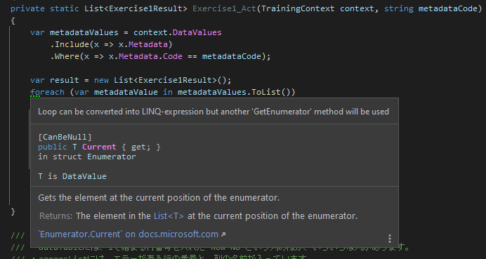
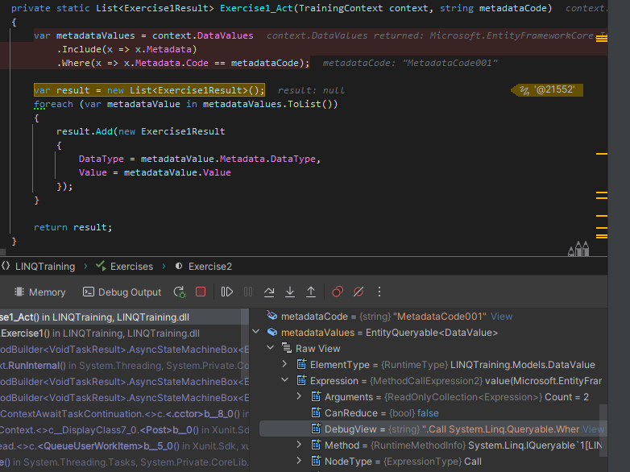
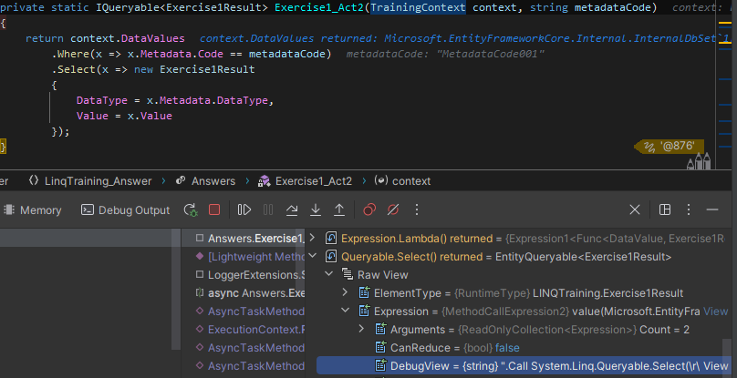
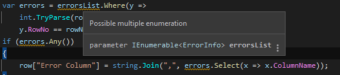
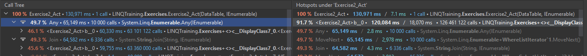

# LINQ演習 テキスト 解説編
---

## 例題1 - ループの除去

* LINQは「集合を集合のまま演算する」ものです。
* ループを記述するということは、集合から要素を１つずつ取り出して、１つずつ演算する、ということですから、LINQを使う意味がありません。

```csharp
public static List<Exercise1Result> Exercise1_Act1(TrainingContext context, string metadataCode)
{
    return context.DataValues
        .Include(x => x.Metadata)
        .Where(x => x.Metadata.Code == metadataCode)
        .ToList()
        .Select(metadataValue => new Exercise1Result
        {
            DataType = metadataValue.Metadata.DataType,
            Value = metadataValue.Value
        })
        .ToList();
}
```

---

## 例題1 - 自動リファクタリング

このパターンのループは機械的に```ToList()```に置き換えが可能です。上のコードはReSharper/Riderで自動リファクタリングしたものです。



---

## 例題1 - IQueryableがSQLに変換する前の式を見る

```IQueryable```をデバッガで調べてみましょう。



---

```IQueryable.Expression.DebugView```の内容を見てみると、SQLに変換される前の式がわかります。

```text
.Call System.Linq.Queryable.Where(
    .Call Microsoft.EntityFrameworkCore.EntityFrameworkQueryableExtensions.Include(
        .Constant<Microsoft.EntityFrameworkCore.Query.Internal.EntityQueryable`1[LINQTraining.Models.DataValue]>(Microsoft.EntityFrameworkCore.Query.Internal.EntityQueryable`1[LINQTraining.Models.DataValue]),
        '(.Lambda #Lambda1<System.Func`2[LINQTraining.Models.DataValue,LINQTraining.Models.Metadata]>)),
    '(.Lambda #Lambda2<System.Func`2[LINQTraining.Models.DataValue,System.Boolean]>))

.Lambda #Lambda1<System.Func`2[LINQTraining.Models.DataValue,LINQTraining.Models.Metadata]>(LINQTraining.Models.DataValue $x)
{
    $x.Metadata
}

.Lambda #Lambda2<System.Func`2[LINQTraining.Models.DataValue,System.Boolean]>(LINQTraining.Models.DataValue $x) {
    ($x.Metadata).Code == .Constant<LINQTraining.Exercises+<>c__DisplayClass5_0>(LINQTraining.Exercises+<>c__DisplayClass5_0).metadataCode
}
```

---

## 例題1 - 実際に実行されるSQLを見る

先のコードで実行されるSQLがコンソールに出力されるので、確認してください。

```sql
SELECT [d].[Id], [d].[Blah000], [d].[Blah001], ..., [d].[Blah099], [d].[MetadataId], [d].[Value], [m].[Id], [m].[Blah000], [m].[Blah001], ..., [m].[Blah099], [m].[Code], [m].[DataType], [m].[Name]
FROM [DataValues] AS [d]
    INNER JOIN [Metadata] AS [m]
ON [d].[MetadataId] = [m].[Id]
WHERE [m].[Code] = @__metadataCode_0
```

必要な列は```[Metadata].[DataType]```と```[DataValues].[Value]```のみなのに、不要な列が大量に取得されています。SQL
Serverとの通信はネットワーク経由になるのが普通ですから、パフォーマンス上の大きなペナルティになり得ます。

これは、```Where```まではSQLに変換されているが、```Select```がSQLに変換されていないので、全部の列をSQL Serverから取ってきて、メモリ上で```Select```を実行しているためです。

---

## 原則 - なるべくクエリオブジェクトのまま引っ張る

* ```foreach```などのイテレーションや、```ToList()```などの即時実行関数は、最終的に必要なデータを作る時まで実行しない

## 原則 - なるべく```IQueryable```のまま引っ張る

* ```IQueryable```で記述されている部分は、SQLに変換されてSQL Server上で実行される
* ```IEnumerable```で記述されている部分は、メモリに展開されてC#上で実行される

## 原則 - ```IQueryable```のうちに絞り込みを行う

* ```IEnumerable```で```Where```や```Select```をしても、通信量を削減できない

---

## 例題1 - ToList()を除去する

原則に従ってリファクタリングします。

```c#
public static IQueryable<Exercise1Result> Exercise1_Act2(TrainingContext context, string metadataCode)
{
    return context.DataValues
        .Where(x => x.Metadata.Code == metadataCode)
        .Select(x => new Exercise1Result
        {
            DataType = x.Metadata.DataType,
            Value = x.Value
        });
}
```

実行されるSQLは、このように必要な列だけを取得するものになりました。

```sql
SELECT [m].[DataType], [d].[Value]
FROM [DataValues] AS [d]
    INNER JOIN [Metadata] AS [m]
ON [d].[MetadataId] = [m].[Id]
WHERE [m].[Code] = @__metadataCode_0
```

---

```Exercise1_Act2```が返す```IQueryable```が実行しようとする式を見てみます。


---

Viewを開くと、このようになっています。

```text
.Call System.Linq.Queryable.Select(
    .Call System.Linq.Queryable.Where(
        .Constant<Microsoft.EntityFrameworkCore.Query.Internal.EntityQueryable`1[LINQTraining.Models.DataValue]>(Microsoft.EntityFrameworkCore.Query.Internal.EntityQueryable`1[LINQTraining.Models.DataValue]),
        '(.Lambda #Lambda1<System.Func`2[LINQTraining.Models.DataValue,System.Boolean]>)),
    '(.Lambda #Lambda2<System.Func`2[LINQTraining.Models.DataValue,LINQTraining.Exercise1Result]>))

.Lambda #Lambda1<System.Func`2[LINQTraining.Models.DataValue,System.Boolean]>(LINQTraining.Models.DataValue $x) {
    ($x.Metadata).Code == .Constant<LinqTraining_Answer.Answers+<>c__DisplayClass6_0>(LinqTraining_Answer.Answers+<>c__DisplayClass6_0).metadataCode
}

.Lambda #Lambda2<System.Func`2[LINQTraining.Models.DataValue,LINQTraining.Exercise1Result]>(LINQTraining.Models.DataValue $x)
{
    .New LINQTraining.Exercise1Result(){
        DataType = ($x.Metadata).DataType,
        Value = $x.Value
    }
}
```

---

## Point - ```Include()```が必要な場合と不要な場合

上の例では何気なく```Include()```を削除してしまいましたが、動いています。

一方、次の場合は、```Include()```を削除すると動きません。

```c#
public static List<Exercise1Result> Exercise1_Act1(TrainingContext context, string metadataCode)
{
    return context.DataValues
        // .Include(x => x.Metadata)
        .Where(x => x.Metadata.Code == metadataCode)
        .ToList()
        .Select(metadataValue => new Exercise1Result
        {
            DataType = metadataValue.Metadata.DataType,
            Value = metadataValue.Value
        })
        .ToList();
}
```

結果

```console
System.NullReferenceException: Object reference not set to an instance of an object.
```

---

## Point - ```Include()```について

* ```Include()```は、ナビゲーションプロパティをメモリにロードすることをEFに指示するコマンドです。
  ナビゲーションプロパティの参照が、```IQueryalble```の世界で完結している場合は、必要ありません。
  大量のデータが不用意にロードされないように、なるべく書かないようにした方が良いです。
* 実行されたSQLからわかるように、この例題は以下のように書き直すことができます。

```c#

```

---

## 例題2

このメソッドは、```errorsList```に書かれた情報に従って、```dataTable```に"Error Column"を追加します。（詳しい関数仕様はソースコードのコメントを参照）

```c#
private static void Exercise2_Act(DataTable dataTable, IEnumerable<ErrorInfo> errorsList)
{
    foreach (var row in dataTable.Rows.OfType<DataRow>())
    {
        var errors = errorsList.Where(y =>
            int.TryParse(row["Row No"].ToString(), out var rowNo) && y.RowNo == rowNo);
        if (errors.Any())
        {
            row["Error Column"] = string.Join(",", errors.Select(x => x.ColumnName));
        }
        else
        {
            row["Error Column"] = string.Empty;
        }
    }
}
```

---

## 例題2 - 問題点

これは、開発中は問題なく動作していたが、実運用では使い物にならない、という典型的な事例です。

* dataTableが増えてもerrorsListは増えない場合
    * 瞬時に処理が完了する
* dataTableの件数に比例してerrorsListの件数も増える場合
    * 開発中に1000件程度のデータでデバッグしていると、瞬時に処理が完了する
    * 実運用で10万件のデータが入ると、10分経っても処理が完了しない

---

## 例題2 - Multiple Enumeration

ReSharper/Riderではこのような警告が表示されます。

これは、errorsListやerrorsに対して、要素を取得する操作が複数回行われていることを意味します。

errorsListやerrorsには、データは入っておらず、データの取得と処理の方法のみが格納されています。LINQでデータ処理を記述すると「中間過程ではデータの取得も演算もしない」から、高速かつ省メモリで処理が行われます。
ところが、上で警告が出ている箇所では、データの取得と演算が行われています。これは最終的な処理結果を得るときには必要なことですが、中間過程で行うのは無駄です。
また、データベースやストリームがデータソースの場合は、一度しか読出しできませんので、エラーが発生します。

---

## 例題2 - 遅い場所を調べる

ReSharper/Riderに付属するdotTraceというプロファイラで遅い箇所を探してみます。



```Where```式内のラムダ式が1億2千万回呼ばれており、実行時間の大半がここで消費されていることがわかります。


---

## 例題2 - Where()の探索アルゴリズム

---

## 例題2 - 探索アルゴリズム

専門的な探索アルゴリズムは色々ありますが、プログラマーが日常的に扱う探索アルゴリズムは、この3種類しかありません。

| 名前       | 概要          | 速さ         | Pros/Cons               |
|----------|-------------|------------|-------------------------|
| 線形探索     | 全要素を探索      | *O(N)*     | 遅いが、単純なので要素が少なければ最速     |
| 二分探索     | 範囲を絞りながら探索  | *O(log2N)* | メモリ消費が少ないが、ソートするので追加が遅い |
| ハッシュテーブル | 要素のハッシュ値で探索 | *O(1)*     | バケットを構築するのでメモリを食う       |

---

## 例題2 - LINQと探索アルゴリズム

何も考えずにLINQを使っていると、線形探索しか使っていないということになりがちです。場面に応じて最適な探索アルゴリズムを選べるようになりましょう。

| アルゴリズム   | コンテナ                                                                         |
|----------|------------------------------------------------------------------------------|
| 線形探索     | ```Array<T>```, ```List<T>```                                                |
| 二分探索     | ```SortedSet<T>```, ```<TKey,TValue>```, ```SortedDictionary<TKey,TValue>``` |
| ハッシュテーブル | ```Set<T>```, ```Dictionary<TKey,TValue>```, ```Lookup<TKey,TElement>```     |

## 例題3 - 

